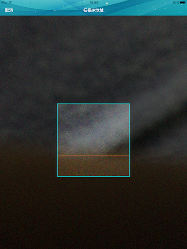
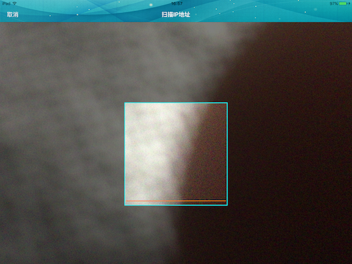

# QRCodeReader
二维码扫描-跨设备界面适配




###Usage 用法
```
	QRCodeReaderViewController *vc = [[QRCodeReaderViewController alloc] initWithQRDelegate:self];
    [self presentViewController:vc animated:true completion:nil];
    
    // 实现代理方法
	-(void)qrcodeReaderController:(QRCodeReaderController *)qrcodeViewController resultForReading:(NSString *)string{
	    NSLog(@"result: %@",string);
	}
```